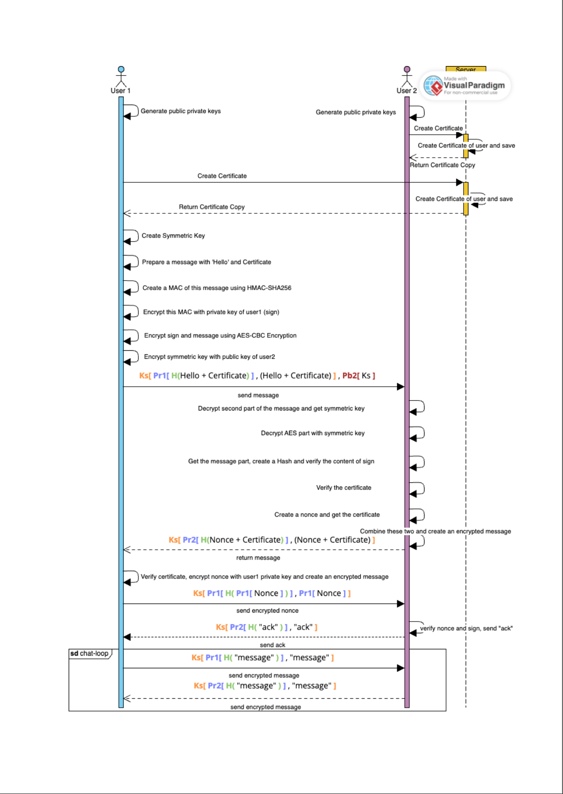
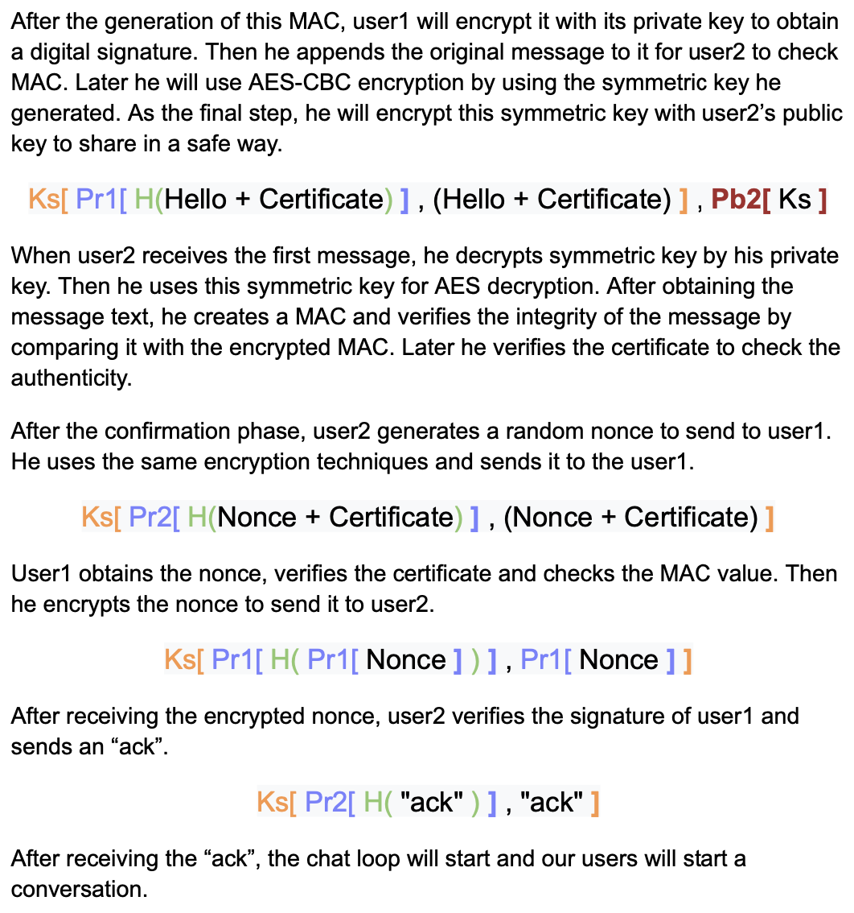
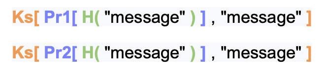

# P2P Encyrpted Messaging System with End-to-End Security

This project is a peer-to-peer messaging system with end-to-end security. The system has two main parts. In the first part, the user will generate public and private keys. In the second part, the user will send messages to other users by using these keys. The system will provide confidentiality, integrity, and authentication for the messages.

This part has 3 main sections: 
- Creation of public keys and certificates
- Handshake process 
- Chat loop.

### Creation of Public Keys and Certificates
At the beginning of this part, the user checks if he/she has public and private keys. If there is no key for this user, user generates public and private keys by using the generation functions in the first part.
After key generation, the user checks for certification. If there is no certificate available in the database, the user asks the server to create a certificate.
Server gets the request, creates a certification for the user. Server saves the certificate to the database and then it returns the user a copy of this certificate.

### Handshake Process
User1 will try to engage in a conversation with user2. In order to achieve this, user1 needs to send a hello+certification message. User1 gets his certification and creates a string “Hello. Then user1 concats these two variables to obtain a single message variable. User1 will use this message to generate a MAC (HMAC-SHA256).

### Chat Loop

Two users will send messages to each other by creating a message text, obtaining a MAC (HMAC-SHA256) and encrypting the message by AES-CBC encryption.

